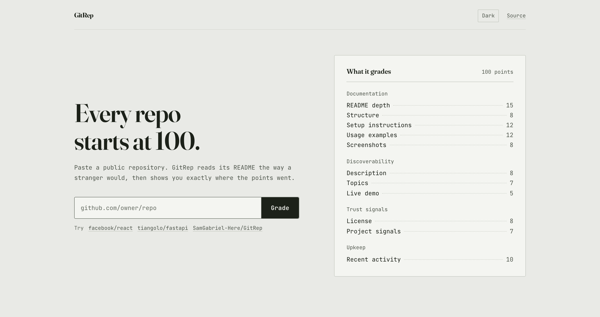
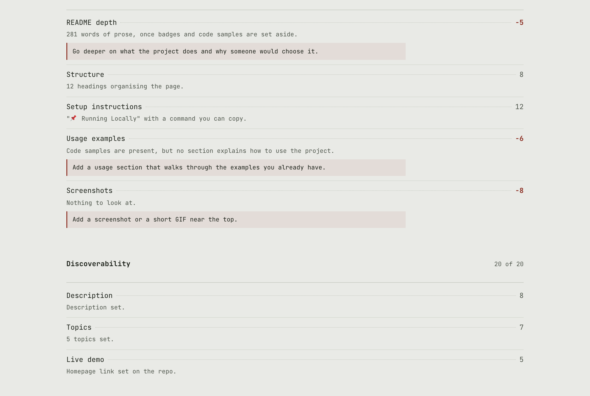
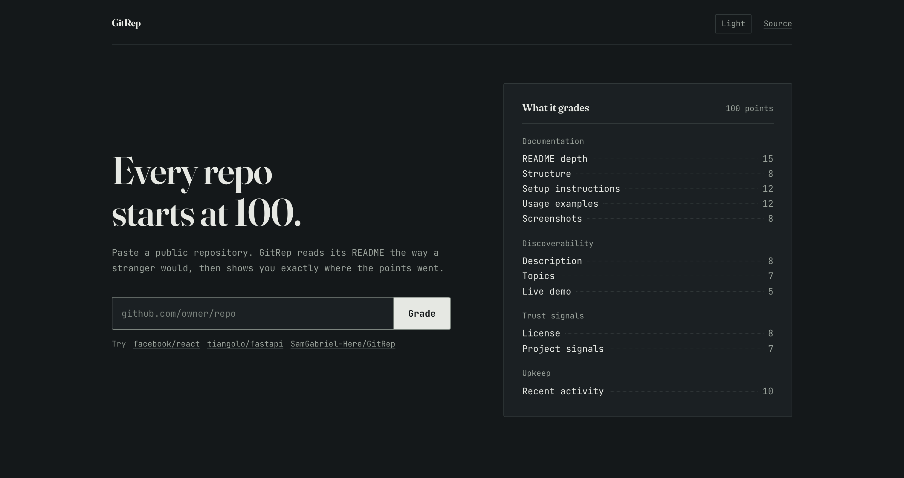

# GitRep

Paste a public GitHub repository and GitRep grades it out of 100, then shows you which
checks took points off and what to do about each one.

The scoring is subtractive on purpose. Every repository starts at 100 and loses points for
the things a first-time visitor notices: a README with no setup commands, or a wall of
badges where a screenshot should be. What comes back is an itemised ledger rather than a
number you have to take on faith.

[](https://github.com/SamGabriel-Here/GitRep/actions/workflows/ci.yml)
[](LICENSE)



## Contents

- [What it grades](#what-it-grades)
- [How a check is scored](#how-a-check-is-scored)
- [Running it locally](#running-it-locally)
- [API reference](#api-reference)
- [Configuration](#configuration)
- [Project structure](#project-structure)
- [How the analysis works](#how-the-analysis-works)
- [Tests](#tests)
- [Design](#design)
- [Deployment](#deployment)
- [Limits and known gaps](#limits-and-known-gaps)

## What it grades

Eleven checks across four categories, weighted to exactly 100 points.

| Category | Check | Points | Full marks when |
| --- | --- | --: | --- |
| Documentation | README depth | 15 | 600+ words of prose, badges and code excluded |
| Documentation | Structure | 8 | Six or more headings organise the page |
| Documentation | Setup instructions | 12 | A setup section containing a command you can copy |
| Documentation | Usage examples | 12 | A usage section containing a worked example |
| Documentation | Screenshots | 8 | Two images, or a GIF or video of the project running |
| Discoverability | Description | 8 | The repo description is a full sentence |
| Discoverability | Topics | 7 | Three or more topics set |
| Discoverability | Live demo | 5 | The repo's homepage field points somewhere |
| Trust signals | License | 8 | GitHub recognises the license |
| Trust signals | Project signals | 7 | Two of: CI, a contributing guide, visible tests |
| Upkeep | Recent activity | 10 | Pushed within the last 90 days |

Documentation is 55 of the 100 points, because it is the part you control entirely and the
part a stranger actually reads.

A score of 85 or above is reported as `exemplary`, 60 to 84 as `solid`, and anything below
60 as `needs work`.



It follows your system's light or dark setting until you override it with the toggle in the
corner, and the choice survives a reload.



## How a check is scored

Partial credit is what makes the report useful. A README with an "Installation" heading and
nothing underneath it scores 8 of 12, because that beats silence but loses to a command you
can copy. Every check that falls short comes back with the reason and a specific fix.

The bands each check uses:

| Check | Scoring |
| --- | --- |
| README depth | 0 if absent, then by prose word count: under 40 → 0, under 120 → 5, under 300 → 10, under 600 → 13, otherwise 15 |
| Structure | By heading count: 0 → 0, 1-2 → 3, 3-5 → 6, 6+ → 8 |
| Setup instructions | Nothing → 0, mentioned in prose only → 5, heading without commands → 8, heading with a code block → 12 |
| Usage examples | Nothing → 0, mentioned only → 4, code but no usage section → 6, section without an example → 8, section with an example → 12 |
| Screenshots | Nothing → 0, badges only → 2, one screenshot → 6, two or a GIF/video → 8 |
| Description | Missing → 0, three words or fewer → 4, otherwise 8 |
| Topics | 0 → 0, 1-2 → 4, 3+ → 7 |
| Live demo | Nothing → 0, a demo link in the README → 4, the repo homepage field set → 5 |
| License | None → 0, present but unrecognised → 4, recognised SPDX → 8 |
| Project signals | By how many of CI, a contributing guide, and tests are found: 0 → 0, 1 → 4, 2+ → 7 |
| Recent activity | By days since the last push: ≤90 → 10, ≤180 → 8, ≤365 → 6, ≤730 → 3, older → 0 |

Each check reports a `status` of `pass` (full marks), `partial` (some points lost), or
`fail` (nothing earned).

## Running it locally

You need Python 3.10 or newer and Node 20 or newer.

### Start the API

```bash
python3 -m venv venv
source venv/bin/activate        # Windows: venv\Scripts\activate
pip install -r requirements.txt
uvicorn app.main:app --app-dir backend --reload
```

The API listens on `http://localhost:8000`, with interactive docs at `/api/docs`.

### Start the web app

In a second terminal:

```bash
cd frontend
npm install
npm run dev
```

Open `http://localhost:5173` and paste a repository URL.

The dev server proxies `/api` to uvicorn, so the front end talks to the same origin locally
that it does in production. There is no API URL to configure.

## API reference

Three endpoints, no authentication.

### `GET /api/health`

Health check.

```json
{ "status": "ok", "version": "2.1.0" }
```

### `GET /api/rubric`

The eleven checks and their weights, with no repository attached. This is what the panel on
the home page is built from.

```json
{
  "total": 100,
  "checks": [
    {
      "id": "readme_depth",
      "category": "documentation",
      "category_label": "Documentation",
      "label": "README depth",
      "possible": 15
    }
  ]
}
```

### `POST /api/analyze`

Grades one repository. The URL can be a full link, an SSH remote, or just `owner/repo`.

```bash
curl -X POST http://localhost:8000/api/analyze \
  -H 'Content-Type: application/json' \
  -d '{"github_url": "tiangolo/fastapi"}'
```

Every check comes back individually, so you can render your own report:

```json
{
  "name": "fastapi/fastapi",
  "score": 97,
  "band": "exemplary",
  "repo": {
    "name": "fastapi/fastapi",
    "owner": "fastapi",
    "url": "https://github.com/fastapi/fastapi",
    "description": "FastAPI framework, high performance...",
    "homepage": "https://fastapi.tiangolo.com/",
    "stars": 79000,
    "forks": 6800,
    "language": "Python",
    "open_issues": 250,
    "license": "MIT",
    "topics": ["python", "api", "async"],
    "pushed_at": "2026-09-02T10:14:00Z",
    "is_fork": false,
    "is_archived": false,
    "has_workflows": true,
    "has_contributing": true,
    "has_tests": true
  },
  "categories": [
    { "id": "documentation", "label": "Documentation", "earned": 55, "possible": 55 }
  ],
  "checks": [
    {
      "id": "install",
      "category": "documentation",
      "label": "Setup instructions",
      "possible": 12,
      "earned": 8,
      "lost": 4,
      "status": "partial",
      "detail": "\"Installation\" exists, but there is no command in it.",
      "fix": "Add a fenced code block with the exact commands to run."
    }
  ],
  "readme": {
    "present": true,
    "words": 1600,
    "headings": 29,
    "code_blocks": 14,
    "images": 2,
    "badges": 6
  },
  "suggestions": ["Add a fenced code block with the exact commands to run."],
  "analysed_at": "2026-09-12T09:41:00Z",
  "rate_remaining": 57
}
```

`suggestions` is the flat list of fixes, ordered by points lost, for anything that wants the
short version without walking `checks`.

Paths carry no trailing slash. FastAPI would answer a mismatch with a 307, and a redirect
behind a serverless proxy is a round trip nobody needs.

Errors come back as `{"detail": "..."}` with a status that says what went wrong: `400` for
an unparseable URL, `404` for a missing or private repo, `429` when GitHub's rate limit is
used up (the message says roughly how long to wait), `502` or `504` when GitHub is
unreachable or slow.

A graded repository also lives in the front end's URL, so `?repo=owner/name` loads that
report directly and any result you are looking at is a link you can send to someone.

## Configuration

These are all optional, and all set as environment variables.

One variable, and it is optional.

| Variable | Default | Purpose |
| --- | --- | --- |
| `GITHUB_TOKEN` | none | Personal access token. Raises the GitHub API limit from 60 to 5,000 requests an hour |

Without a token you get 60 requests an hour, which runs out faster than you would expect.
Set one before you demo this to anybody.

The app only reads public repositories, so it needs no scopes at all: a classic token with
every box unticked already lifts the limit, and a fine-grained token needs nothing beyond
read access to public repositories. Do not grant it `repo`.

There is no API URL or CORS origin to configure, because the site and the API share an
origin. Everything the backend reads from the environment lives in `backend/app/config.py`.

Results are cached in memory for five minutes per repository, so grading the same repo twice
in a row costs one GitHub request rather than four.

## Project structure

```
.
├── api/
│   └── index.py            Vercel entrypoint: puts backend/ on the path, exports the app
├── backend/
│   ├── app/
│   │   ├── config.py       environment settings, in one place
│   │   ├── main.py         FastAPI app and the three routes, all under /api
│   │   ├── schemas.py      request models
│   │   ├── github/
│   │   │   ├── client.py   async GitHub client, cache, error mapping
│   │   │   └── repo_url.py URL and owner/repo parsing
│   │   └── rubric/
│   │       ├── readme.py   markdown to a structured document
│   │       ├── checks.py   the eleven weighted checks
│   │       └── engine.py   runs them, totals categories, picks the band
│   └── tests/              mirrors the modules above
├── frontend/
│   ├── index.html          fonts and the pre-paint theme script
│   ├── vite.config.js      dev proxy from /api to uvicorn
│   └── src/
│       ├── App.jsx         state and composition
│       ├── components/     Masthead, GradeForm, Rubric, Report, LedgerRow, ThemeToggle
│       ├── hooks/          useTheme
│       ├── lib/            api client, formatters, share-URL helpers
│       └── styles/         tokens.css (the design tokens), app.css
├── docs/                   the logo and the screenshots used by this README
├── DESIGN.md               the design system contract
├── requirements.txt        Python dependencies, read by Vercel and by local setup
└── vercel.json             build, function, and routing config
```

## How the analysis works

Asking whether a README explains installation is harder than searching it for the word
"install". That substring also sits inside `uninstall`, and inside every code sample that
mentions a package manager.

So `rubric/readme.py` takes the document apart before the checks ask it anything. Fenced
code blocks come out first, replaced by markers that hold their position. Images get sorted
into screenshots and badges by URL, because a shields.io badge is not a picture of your
project. Link targets go, link text stays. Headings become a tree, where a section runs
until the next heading at its own level or higher, so `## Example` still owns the code
sitting under `### Create it`.

`rubric/checks.py` then asks its questions of that structure. Section matching prefers a
section that contains commands over one that merely has a matching title, which is what
stops "Requirements" beating "Installation" for the setup check.

`github/client.py` fetches the repository, its README, its root tree, and its workflows
concurrently over httpx, so a grade costs one round trip rather than four in sequence.

## Tests

```bash
python -m pytest backend/tests -q
```

Fifty-four tests, mirroring the modules they cover:

- `test_readme.py` covers the parser: badge walls that should not count as screenshots,
  unclosed code fences, setext headings, HTML comments, and sections owning their
  subsections.
- `test_checks.py` covers the rubric: `Uninstall` headings that should not count as setup
  instructions, the graded bands for every check, and that the weights still total 100.
- `test_repo_url.py` covers every URL shape that should resolve to the same repository, and
  the ones that should be rejected.

CI runs the same suite on every push, alongside the front end's lint and build.

## Design

The interface is documented in [DESIGN.md](DESIGN.md): tokens, the type scale, spacing,
every component with its states, the motion timings, the depth strategy, measured contrast
ratios for both themes, and the accepted debt. Read it before changing anything visual.

## Deployment

Vercel serves the built front end from its CDN and runs the API beside it as a Python
function, so both live on one origin.

1. On Vercel, choose **Add New → Project** and import this repository.
2. Leave the build settings alone. [`vercel.json`](vercel.json) already sets the build
   command, the output directory, and the rewrite that sends `/api/*` to the function.
3. Add `GITHUB_TOKEN` under **Settings → Environment Variables** before the first deploy, or
   the API runs on GitHub's 60 requests an hour.

The function has a 15 second ceiling, which is generous: a grade is one GitHub call followed
by three concurrent ones, and the client gives up on any of them after 10.

This used to deploy to Render, whose free tier spins a service down after about fifteen
minutes idle and then takes roughly fifty seconds to answer the next request. The interface
carried a note apologising for it. Vercel's functions start in a fraction of a second, so
both the note and the second origin are gone.

The one thing lost in the move is the five minute cache in `github/client.py`. It lives in
process, and serverless instances are short-lived, so it now helps only within a warm one.
With a token raising the limit to 5,000 requests an hour, that is a fair trade.

## Limits and known gaps

- Only public repositories. There is no OAuth flow, so a private repo reads as missing.
- The rubric judges presentation, not code. A beautifully documented project with broken
  code scores well, which is the intended scope rather than an oversight.
- Heading matching is English-only. A README written in another language will lose the setup
  and usage checks even when it explains both.
- The cache is in-process. On serverless it only helps within a warm instance, so the same
  repository graded twice may cost two sets of GitHub calls.

## License

MIT. See [LICENSE](LICENSE).
