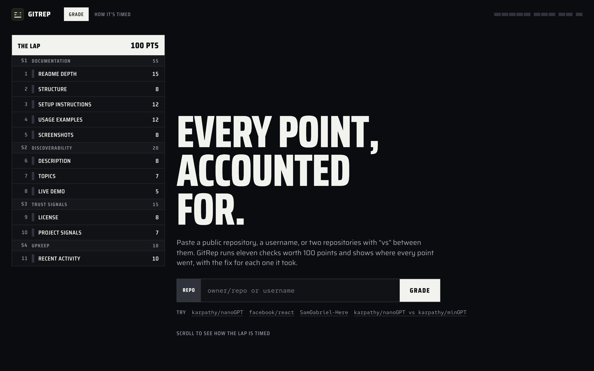
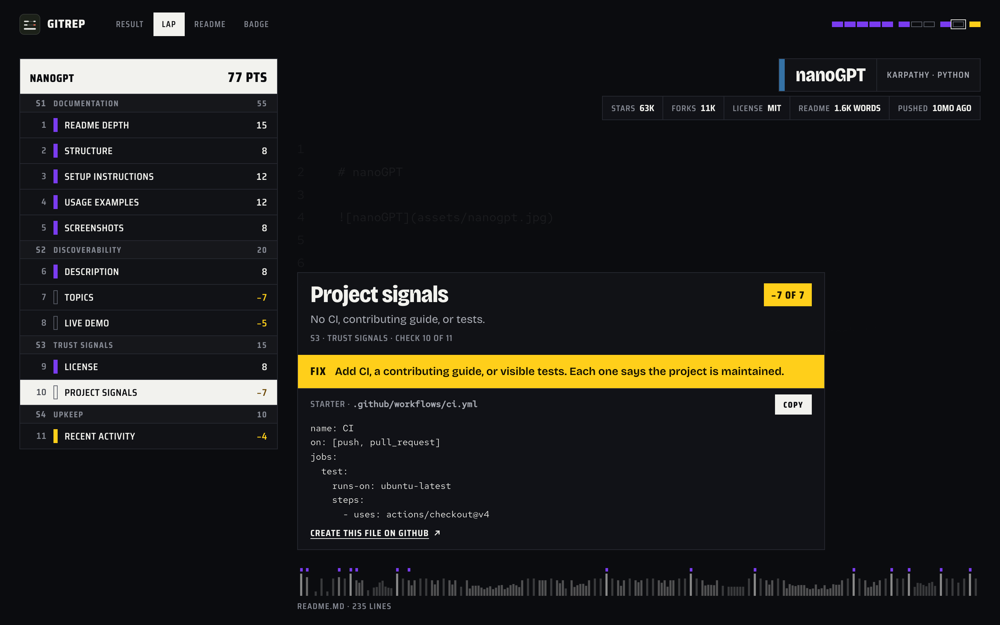
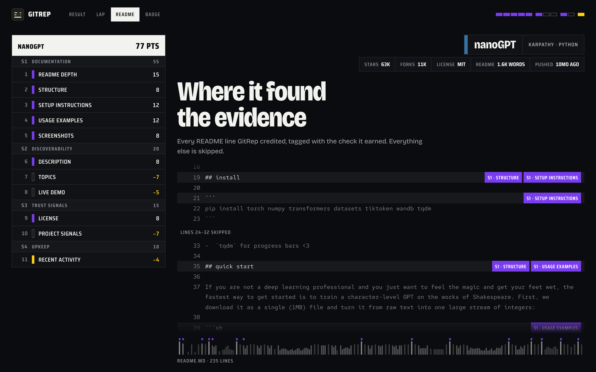
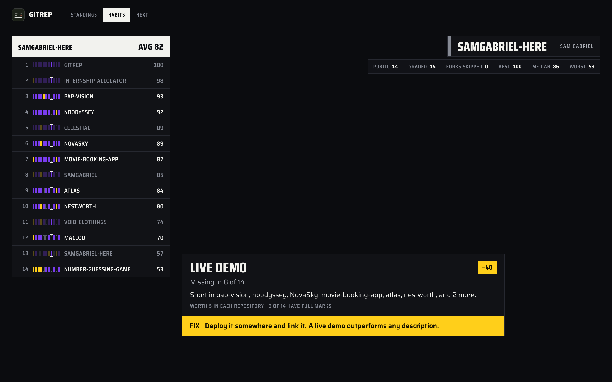
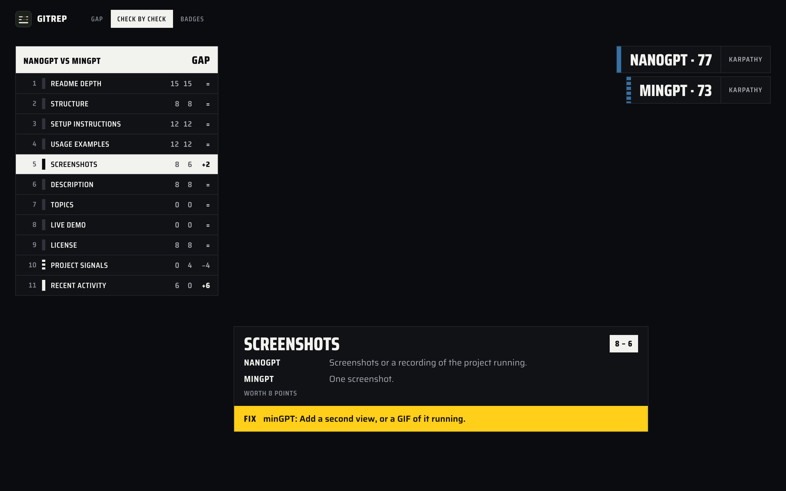

# GitRep

Paste a public GitHub repository and GitRep grades it out of 100, then shows you which
checks took points off, where in the README it looked, and what to do about each one. Paste
a username instead and it grades everything they have published, then tells you which habit
is costing them the most. Put two repositories side by side with `vs` between them and it
compares them check by check.

The scoring is subtractive on purpose. Every repository starts at 100 and loses points for
the things a first-time visitor notices: a README with no setup commands, or a wall of
badges where a screenshot should be. What comes back is an itemised account, with the
evidence for every point it gave and a starter fix for every point it took, rather than a
number you have to take on faith.

**Live at [getgitrep.vercel.app](https://getgitrep.vercel.app).** Paste any public repo or username,
or open `?target=owner/name` to link straight to a graded report.

[](https://github.com/SamGabriel-Here/GitRep/actions/workflows/ci.yml)
[](LICENSE)
[](https://getgitrep.vercel.app/?target=SamGabriel-Here/GitRep)



## Contents

- [What it grades](#what-it-grades)
- [Reading a report](#reading-a-report)
- [How a check is scored](#how-a-check-is-scored)
- [Grading a whole profile](#grading-a-whole-profile)
- [Comparing two repositories](#comparing-two-repositories)
- [The README badge](#the-readme-badge)
- [Running it locally](#running-it-locally)
- [API reference](#api-reference)
- [Configuration](#configuration)
- [Project structure](#project-structure)
- [How the analysis works](#how-the-analysis-works)
- [Tests](#tests)
- [Design](#design)
- [Deployment](#deployment)
- [Limits and known gaps](#limits-and-known-gaps)

## What it grades

Eleven checks across four categories, weighted to exactly 100 points.

| Category | Check | Points | Full marks when |
| --- | --- | --: | --- |
| Documentation | README depth | 15 | 600+ words of prose, badges and code excluded |
| Documentation | Structure | 8 | Six or more headings organise the page |
| Documentation | Setup instructions | 12 | A setup section containing a command you can copy |
| Documentation | Usage examples | 12 | A usage section containing a worked example |
| Documentation | Screenshots | 8 | Two images, or a GIF or video of the project running |
| Discoverability | Description | 8 | The repo description is a full sentence |
| Discoverability | Topics | 7 | Three or more topics set |
| Discoverability | Live demo | 5 | The repo's homepage field points somewhere |
| Trust signals | License | 8 | GitHub recognises the license |
| Trust signals | Project signals | 7 | Two of: CI, a contributing guide, visible tests |
| Upkeep | Recent activity | 10 | Pushed within the last 90 days |

Documentation is 55 of the 100 points, because it is the part you control entirely and the
part a stranger actually reads.

A score of 85 or above is reported as `exemplary`, 60 to 84 as `solid`, and anything below
60 as `needs work`.

## Reading a report

The interface is built like the timing graphics of a race broadcast. A graded repository is a
lap: the eleven checks are its mini-sectors, and the four categories are its sectors. The
tower on the left never leaves the screen; it is the same object on every view, re-sorted
for whatever you are looking at.

When a report lands, the lap replays. Each sector lights in turn, purple for full marks,
yellow for points lost and a hollow outline for nothing earned, and the score counts up
beside the verdict.

Scroll, and the page stays where it is while the graphics change. Each step of the scroll
puts one check in the lower third: what GitRep found, the fix, and a starter you can copy
or a link that does the job on GitHub. A missing CI setup comes with a workflow file for the
repository's language and a link that opens GitHub's editor with it already filled in.



Under the graphics runs the README as a barcode, one mark per line, taller for headings
and denser for code, with a tick above every line that earned a point. As the lap moves from
check to check, the marker moves to the line that check found, and the README itself drifts
behind the graphics to the same place.

The last part of the lap shows that evidence directly. Every README line GitRep credited is
listed with a few lines of context, tagged with the check it earned, and the rest of the file
is skipped.



The top bar carries a cue for each part of the report and the eleven sectors as buttons, so
any check is one click away. On a phone the same pieces stack into one scrolling page.

## How a check is scored

Partial credit is what makes the report useful. A README with an "Installation" heading and
nothing underneath it scores 8 of 12, because that beats silence but loses to a command you
can copy. Every check that falls short comes back with the reason and a specific fix.

The bands each check uses:

| Check | Scoring |
| --- | --- |
| README depth | 0 if absent, then by prose word count: under 40 → 0, under 120 → 5, under 300 → 10, under 600 → 13, otherwise 15 |
| Structure | By heading count: 0 → 0, 1-2 → 3, 3-5 → 6, 6+ → 8 |
| Setup instructions | Nothing → 0, mentioned in prose only → 5, heading without commands → 8, heading with a code block → 12 |
| Usage examples | Nothing → 0, mentioned only → 4, code but no usage section → 6, section without an example → 8, section with an example → 12 |
| Screenshots | Nothing → 0, badges only → 2, one screenshot → 6, two or a GIF/video → 8 |
| Description | Missing → 0, three words or fewer → 4, otherwise 8 |
| Topics | 0 → 0, 1-2 → 4, 3+ → 7 |
| Live demo | Nothing → 0, a demo link in the README → 4, the repo homepage field set → 5 |
| License | None → 0, present but unrecognised → 4, recognised SPDX → 8 |
| Project signals | By how many of CI, a contributing guide, and tests are found: 0 → 0, 1 → 4, 2+ → 7 |
| Recent activity | By days since the last push: ≤90 → 10, ≤180 → 8, ≤365 → 6, ≤730 → 3, older → 0 |

Each check reports a `status` of `pass` (full marks), `partial` (some points lost), or
`fail` (nothing earned).

## Grading a whole profile

A single scorecard tells you about one repository. Twenty of them tell you about a person,
but only if you add them up, so a profile report leads with the running total per check
rather than a wall of individual scores.

The tower becomes the standings: every repository, best first, each with its eleven sectors
in miniature. Scrolling steps through the habits costing the most points, and as each one
comes up, every repository in the standings shows that one check, while the ones that already
pass it step back. The lower third names the repositories that fall short and the fix.



That is the thing worth acting on. Adding a license to eight repositories is an afternoon,
and it is worth more than perfecting the README of the one you like best.

The rules:

- Forks are skipped. A fork's README is somebody else's writing, and grading it would say
  nothing about how you write.
- The twenty most recently pushed repositories are graded. A profile costs three GitHub
  calls per repository and the serverless function has fifteen seconds, so the cap is a
  latency budget rather than a preference.
- Picking a repository in the standings grades it on its own.

## Comparing two repositories

Type two repositories with `vs` between them, or open `?compare=owner/one,owner/two`. The
tower becomes a head-to-head: both scores for every check and the gap between them. Scrolling
steps through the checks where they differ, with each side's reason and the fix for whichever
is behind.



## The README badge

Every graded repository has a badge: the score and one mark per check, in the same colours
as the tower. The end of every report shows it with the markdown to paste.

```markdown
[](https://getgitrep.vercel.app/?target=OWNER/REPO)
```

GitHub proxies README images through its own servers and strips anything external, so the
badge is drawn in the system font rather than a web font. It is cached for an hour, so a fix
you push shows up on the badge within one.

## Running it locally

You need Python 3.10 or newer and Node 20 or newer.

### Start the API

```bash
python3 -m venv venv
source venv/bin/activate        # Windows: venv\Scripts\activate
pip install -r requirements.txt
uvicorn app.main:app --app-dir backend --reload
```

The API listens on `http://localhost:8000`, with interactive docs at `/api/docs`.

### Start the web app

In a second terminal:

```bash
cd frontend
npm install
npm run dev
```

Open `http://localhost:5173` and paste a repository URL.

The dev server proxies `/api` to uvicorn, so the front end talks to the same origin locally
that it does in production. There is no API URL to configure.

## API reference

Four endpoints, no authentication.

### `GET /api/health`

Health check.

```json
{ "status": "ok", "version": "3.0.0" }
```

### `GET /api/rubric`

The eleven checks and their weights, with no repository attached. The home page's tower is
built from this.

```json
{
  "total": 100,
  "checks": [
    {
      "id": "readme_depth",
      "category": "documentation",
      "category_label": "Documentation",
      "label": "README depth",
      "possible": 15
    }
  ]
}
```

### `POST /api/analyze`

Grades one repository, or a whole profile. The input can be a full link, an SSH remote,
`owner/repo`, or a bare username. The server decides which was pasted and says so in `kind`,
so a client switches on that rather than parsing GitHub URLs itself.

```bash
curl -X POST http://localhost:8000/api/analyze \
  -H 'Content-Type: application/json' \
  -d '{"github_url": "karpathy/nanoGPT"}'
```

Every check comes back individually, with the README lines it credited in `evidence`:

```json
{
  "kind": "repo",
  "score": 77,
  "band": "solid",
  "repo": {
    "name": "karpathy/nanoGPT",
    "owner": "karpathy",
    "url": "https://github.com/karpathy/nanoGPT",
    "description": "The simplest, fastest repository for training/finetuning medium-sized GPTs.",
    "homepage": "",
    "stars": 63360,
    "forks": 10892,
    "language": "Python",
    "license": "MIT",
    "topics": [],
    "pushed_at": "2025-11-12T19:52:34Z",
    "default_branch": "master",
    "is_fork": false,
    "is_archived": false,
    "has_workflows": false,
    "has_contributing": false,
    "has_tests": false
  },
  "categories": [
    { "id": "documentation", "label": "Documentation", "earned": 55, "possible": 55 }
  ],
  "checks": [
    {
      "id": "install",
      "category": "documentation",
      "label": "Setup instructions",
      "possible": 12,
      "earned": 12,
      "lost": 0,
      "status": "pass",
      "detail": "\"install\" with a command you can copy.",
      "fix": "",
      "evidence": [
        { "line": 19, "kind": "heading", "text": "## install" },
        { "line": 21, "kind": "code", "text": "```" }
      ]
    }
  ],
  "readme": {
    "present": true,
    "words": 1620,
    "headings": 11,
    "code_blocks": 15,
    "images": 2,
    "badges": 1,
    "text": "\n# nanoGPT\n\n\n...",
    "truncated": false
  },
  "suggestions": ["Add topics so the repo turns up when people browse by subject."],
  "analysed_at": "2026-09-27T09:41:00Z",
  "rate_remaining": 4930
}
```

`evidence` lines are 1-based and count lines of the README as it was written, so they still
point at the right place after the parser has set code blocks and comments aside. A check
that reads nothing from the README (the license, the topics) has an empty list. `readme.text`
is the README itself, capped at 1,500 lines, with `truncated` saying whether the cap was hit.

`suggestions` is the flat list of fixes, ordered by points lost, for anything that wants the
short version without walking `checks`.

A profile comes back as `kind: "profile"` instead, with the per-check totals in `habits`
(ordered by points lost) and the individual reports in `repos` (ordered best first):

```json
{
  "kind": "profile",
  "owner": { "login": "SamGabriel-Here", "public_repos": 14 },
  "analysed": 14,
  "eligible": 14,
  "skipped_forks": 0,
  "average": 82,
  "median": 86,
  "best": 100,
  "worst": 53,
  "band": "solid",
  "habits": [
    {
      "id": "signals",
      "label": "Project signals",
      "possible": 98,
      "lost": 50,
      "failing": 5,
      "partial": 5,
      "passing": 4,
      "detail": "Missing in 5, thin in 5, of 14.",
      "fix": "Add CI, a contributing guide, or visible tests. Each one says the project is maintained."
    }
  ],
  "repos": [{ "name": "SamGabriel-Here/GitRep", "score": 100, "band": "exemplary", "checks": [] }]
}
```

### `GET /api/badge/{owner}/{repo}.svg`

The README badge. Always an image, even when grading fails: a repository that does not exist
gets a badge that says so rather than a broken image. Graded badges are cached for an hour
(`Cache-Control: public, max-age=3600`), failures for five minutes.

### Errors

Paths carry no trailing slash. FastAPI would answer a mismatch with a 307, and a redirect
behind a serverless proxy is a round trip nobody needs.

Errors come back as `{"detail": "..."}` with a status that says what went wrong: `400` for
an unparseable URL, `404` for a missing or private repo, `429` when GitHub's rate limit is
used up (the message says roughly how long to wait), `502` or `504` when GitHub is
unreachable or slow.

Any report you are looking at lives in the front end's URL: `?target=owner/name` for a
repository, `?target=owner` for a profile, `?compare=owner/one,owner/two` for a comparison.

## Configuration

One variable, and it is optional.

| Variable | Default | Purpose |
| --- | --- | --- |
| `GITHUB_TOKEN` | none | Personal access token. Raises the GitHub API limit from 60 to 5,000 requests an hour |

Without a token you get 60 requests an hour, which runs out faster than you would expect.
Set one before you demo this to anybody.

The app only reads public repositories, so it needs no scopes at all: a classic token with
every box unticked already lifts the limit, and a fine-grained token needs nothing beyond
read access to public repositories. Do not grant it `repo`.

There is no API URL or CORS origin to configure, because the site and the API share an
origin. Everything the backend reads from the environment lives in `backend/app/config.py`.

Results are cached in memory for five minutes per repository, so grading the same repo twice
in a row costs one GitHub request rather than four.

## Project structure

```
.
├── api/
│   └── index.py            Vercel entrypoint: puts backend/ on the path, exports the app
├── backend/
│   ├── app/
│   │   ├── config.py       environment settings, in one place
│   │   ├── main.py         FastAPI app and the four routes, all under /api
│   │   ├── badge.py        the README badge, as an SVG
│   │   ├── schemas.py      request models
│   │   ├── github/
│   │   │   ├── client.py   async GitHub client, cache, error mapping
│   │   │   └── repo_url.py decides whether you pasted a repo or a profile
│   │   └── rubric/
│   │       ├── readme.py   markdown to a structured document, with source lines
│   │       ├── checks.py   the eleven weighted checks and their evidence
│   │       └── engine.py   runs them, for one repo or a whole profile
│   └── tests/              mirrors the modules above
├── frontend/
│   ├── index.html          fonts and share metadata
│   ├── vite.config.js      dev proxy from /api to uvicorn
│   └── src/
│       ├── App.jsx         the route, the fetch, and which view to show
│       ├── views/          HomeView, RepoView, ProfileView, CompareView
│       ├── components/     Stage (the pinned scroll stage), broadcast (tower,
│       │                  lower third, track map, straps, badge panel)
│       ├── hooks/          useMedia, useCountUp
│       ├── lib/            API client and routes, rubric knowledge and starters, formatters
│       └── styles/         tokens.css (the design tokens), then frame, graphics, pages
├── docs/                   the logo and the screenshots used by this README
├── DESIGN.md               the design system contract
├── PRODUCT.md              who it is for and what it has to do
├── requirements.txt        Python dependencies, read by Vercel and by local setup
└── vercel.json             build, function, and routing config
```

## How the analysis works

Asking whether a README explains installation is harder than searching it for the word
"install". That substring also sits inside `uninstall`, and inside every code sample that
mentions a package manager.

So `rubric/readme.py` takes the document apart before the checks ask it anything. Fenced
code blocks come out first, replaced by markers that hold their position. Images get sorted
into screenshots and badges by URL, because a shields.io badge is not a picture of your
project, and any host that calls itself a badge service counts as one. Link targets go, link
text stays. Headings become a tree, where a section runs until the next heading at its own
level or higher, so `## Example` still owns the code sitting under `### Create it`.

Every one of those steps keeps a map back to the original lines. That is what lets a check
say "line 19" and mean the line you wrote, not the line of some intermediate text.

`rubric/checks.py` then asks its questions of that structure. Section matching prefers a
section that contains commands over one that merely has a matching title, which is what
stops "Requirements" beating "Installation" for the setup check.

`github/client.py` fetches the repository, its README, its root tree, and its workflows
concurrently over httpx, so a grade costs one round trip rather than four in sequence.

## Tests

```bash
python -m pytest backend/tests -q
```

One hundred and twenty-one tests, mirroring the modules they cover:

- `test_readme.py` covers the parser: badge walls that should not count as screenshots,
  badge services hosted on deploy domains, unclosed code fences, setext headings, HTML
  comments, sections owning their subsections, and source lines surviving all of them.
- `test_checks.py` covers the rubric: `Uninstall` headings that should not count as setup
  instructions, the graded bands for every check, the evidence each check points at, the
  README text cap, and that the weights still total 100.
- `test_repo_url.py` covers every URL shape that should resolve to the same repository, which
  shapes are a profile instead, and the ones that should be rejected.
- `test_client.py` covers the difference between a repository that has no README and a
  request that ran out of rate limit, which is the distinction that decides whether a report
  is honestly missing or confidently wrong.
- `test_badge.py` covers the badge: one mark per check, hollow marks for zero, escaping, the
  cache headers, and that a missing repository still gets an image.

CI runs the same suite on every push, alongside the front end's lint and build.

## Design

The interface is documented in [DESIGN.md](DESIGN.md): the tokens, the type, the tower and
the lower third, the scroll stage and its motion, the narrow layout, contrast, and the accepted
debt. Read it before changing anything visual. [PRODUCT.md](PRODUCT.md) says who the app is
for and what it has to do.

## Deployment

Vercel serves the built front end from its CDN and runs the API beside it as a Python
function, so both live on one origin.

1. On Vercel, choose **Add New → Project** and import this repository.
2. Leave the build settings alone. [`vercel.json`](vercel.json) already sets the build
   command, the output directory, and the rewrite that sends `/api/*` to the function.
3. Add `GITHUB_TOKEN` under **Settings → Environment Variables** before the first deploy, or
   the API runs on GitHub's 60 requests an hour.

The function has a 15 second ceiling, which is generous: a grade is one GitHub call followed
by three concurrent ones, and the client gives up on any of them after 10.

The five minute cache in `github/client.py` lives in process, and serverless instances are
short-lived, so it helps only within a warm one. The badge leans on Vercel's CDN instead,
through its cache headers.

## Limits and known gaps

- Only public repositories. There is no OAuth flow, so a private repo reads as missing.
- A profile grades at most twenty repositories, most recently pushed first, and skips forks.
- The rubric judges presentation, not code. A beautifully documented project with broken
  code scores well, which is the intended scope rather than an oversight.
- Heading matching is English-only. A README written in another language will lose the setup
  and usage checks even when it explains both.
- The starters are templates, not advice about your project: the CI file assumes the usual
  commands for the repository's language, and the README skeletons have placeholders.
- A comparison grades both repositories from scratch, so it costs twice the GitHub calls.
- The cache is in-process. On serverless it only helps within a warm instance, so the same
  repository graded twice may cost two sets of GitHub calls.

## License

MIT. See [LICENSE](LICENSE).
